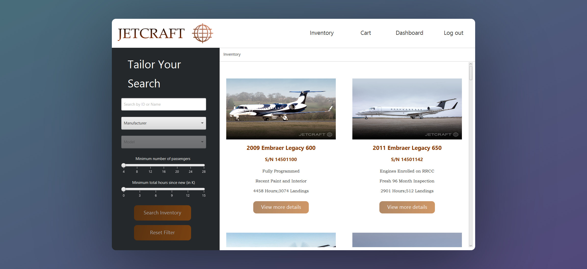

# JETCRAFT : Private Jet Management System 

JETCRAFT is a robust full-stack Private Jet Management System developed using Java (with JavaFX frontend) and MYSQL. It offers a seamless user experience for administrators and clients, with features designed to streamline operations and enhance user interaction.

Inspired by [Jetcraft](https://www.jetcraft.com/inventory/), a leading platform in private aviation, JETCRAFT aims to replicate its functionalities while adding enhancements and customizations. 

